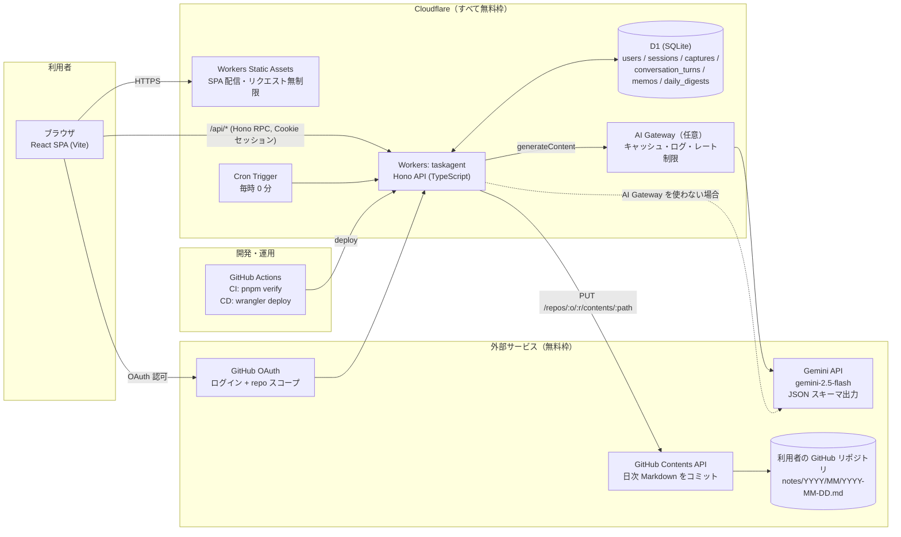

# 01. システム構成図

インフラ（Cloudflare 無料枠）・ミドルウェア・アプリの構成を 1 枚にまとめる。

## レイヤ対応表

| レイヤ | 実体 | 場所 | 無料枠の上限（2026-09 時点、公式ページで要再確認） |
|---|---|---|---|
| IaaS/エッジ | Cloudflare Workers | `src/server` | 100,000 req/日、CPU 10ms/req |
| 静的配信 | Workers Static Assets | `dist/client` | リクエスト無制限 |
| DB | D1 | `migrations` | 5GB、読 5M 行/日、書 100k 行/日 |
| ジョブ | Cron Triggers | `wrangler.jsonc` `triggers.crons` | 無料プランで利用可 |
| LLM ゲートウェイ | AI Gateway（任意） | `GEMINI_BASE_URL` | 無料 |
| LLM | Gemini API（AI Studio キー） | `lib/gemini.ts` | 無料枠あり（RPM/RPD 制限） |
| 認証 | GitHub OAuth App | `routes/auth.ts` | 無料 |
| 永続ノート | 利用者の GitHub リポジトリ | `lib/github.ts` | 無料 |
| CI/CD | GitHub Actions | `.github/workflows` | public: 無制限 / private: 2,000 分/月 |

## リクエストの通り道

1. `GET /` → Static Assets が `index.html` を返す（`run_worker_first` は `/api/*` のみ）。
2. `POST /api/captures` → Worker（Hono）→ D1 に生入力を保存 → Gemini に JSON スキーマ付きで問い合わせ → 質問 or メモを D1 に保存 → JSON 応答。
3. 毎時 0 分 → Cron → 各ユーザーの現地時刻が `digest_hour` なら、その日のメモを Markdown 化 → Gemini で振り返り生成 → GitHub Contents API で 1 コミット。

## 無料枠で収まる根拠（1 ユーザー・1 日あたり）

| 操作 | Worker リクエスト | D1 書込 | Gemini 呼び出し | GitHub API |
|---|---|---|---|---|
| メモ 10 件（各 2 ラウンド） | 20 | 約 60 | 20 | 0 |
| 画面表示 | 約 50 | 0 | 0 | 0 |
| 日次コミット | Cron 24 回 | 1 | 1 | 2 |
| 合計 | 約 100 | 約 60 | 約 21 | 2 |

→ Workers 100k req/日、D1 100k 書込/日に対して 1,000 ユーザー規模まで余裕がある。Gemini の無料枠（RPD）が最初に効くボトルネックなので、AI Gateway のレート制限で守る。
