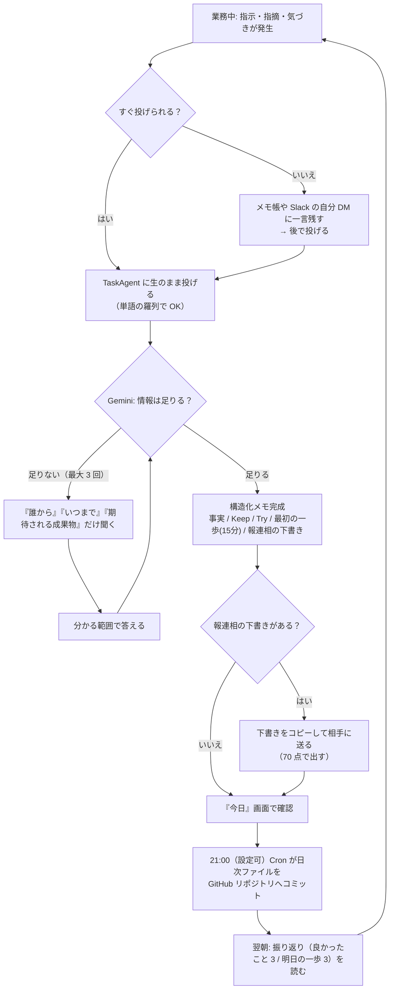
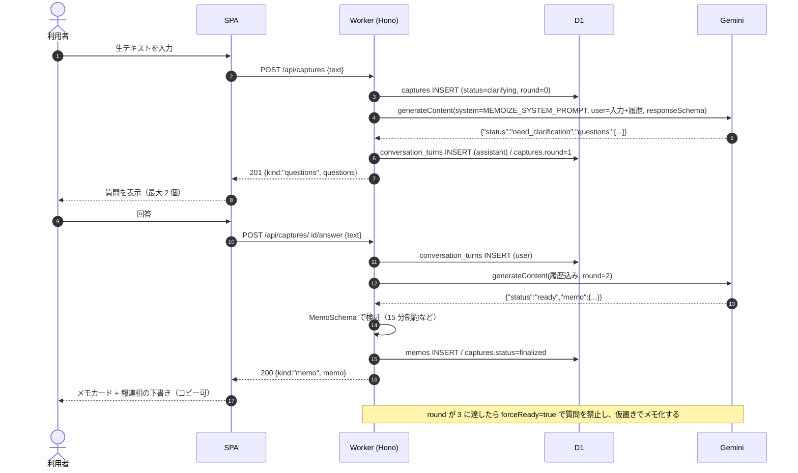
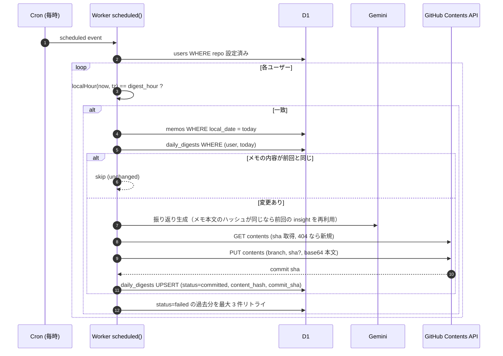
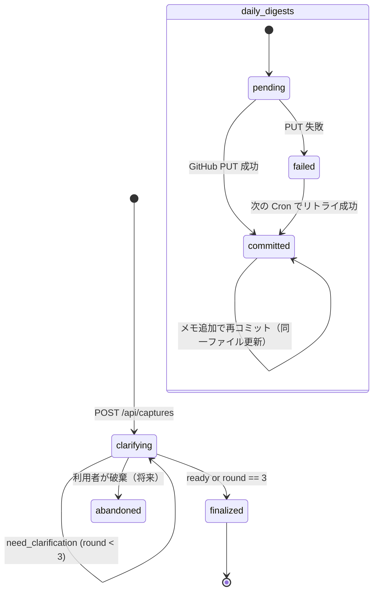

# 02. 業務フロー図

## 2-1. 1 日のサイクル（利用者視点）

```mermaid
flowchart TD
  A["業務中: 指示・指摘・気づきが発生"] --> B{"すぐ投げられる？"}
  B -- "はい" --> C["TaskAgent に生のまま投げる<br/>（単語の羅列で OK）"]
  B -- "いいえ" --> B2["メモ帳や Slack の自分 DM に一言残す<br/>→ 後で投げる"] --> C
  C --> D{"Gemini: 情報は足りる？"}
  D -- "足りない（最大 3 回）" --> E["『誰から』『いつまで』『期待される成果物』だけ聞く"] --> F["分かる範囲で答える"] --> D
  D -- "足りる" --> G["構造化メモ完成<br/>事実 / Keep / Try / 最初の一歩(15分) / 報連相の下書き"]
  G --> H{"報連相の下書きがある？"}
  H -- "はい" --> I["下書きをコピーして相手に送る<br/>（70 点で出す）"]
  H -- "いいえ" --> J["『今日』画面で確認"]
  I --> J
  J --> K["21:00（設定可）Cron が日次ファイルを<br/>GitHub リポジトリへコミット"]
  K --> L["翌朝: 振り返り（良かったこと 3 / 明日の一歩 3）を読む"]
  L --> A
```

## 2-2. メモ化の対話（システム視点）

```mermaid
sequenceDiagram
  autonumber
  actor U as 利用者
  participant S as SPA
  participant W as Worker (Hono)
  participant D as D1
  participant G as Gemini

  U->>S: 生テキストを入力
  S->>W: POST /api/captures {text}
  W->>D: captures INSERT (status=clarifying, round=0)
  W->>G: generateContent(system=MEMOIZE_SYSTEM_PROMPT, user=入力+履歴, responseSchema)
  G-->>W: {"status":"need_clarification","questions":[...]}
  W->>D: conversation_turns INSERT (assistant) / captures.round=1
  W-->>S: 201 {kind:"questions", questions}
  S-->>U: 質問を表示（最大 2 個）
  U->>S: 回答
  S->>W: POST /api/captures/:id/answer {text}
  W->>D: conversation_turns INSERT (user)
  W->>G: generateContent(履歴込み, round=2)
  G-->>W: {"status":"ready","memo":{...}}
  W->>W: MemoSchema で検証（15 分制約など）
  W->>D: memos INSERT / captures.status=finalized
  W-->>S: 200 {kind:"memo", memo}
  S-->>U: メモカード + 報連相の下書き（コピー可）
  Note over W,G: round が 3 に達したら forceReady=true で質問を禁止し、仮置きでメモ化する
```

## 2-3. 日次コミット（Cron）

```mermaid
sequenceDiagram
  autonumber
  participant C as Cron (毎時)
  participant W as Worker scheduled()
  participant D as D1
  participant G as Gemini
  participant GH as GitHub Contents API

  C->>W: scheduled event
  W->>D: users WHERE repo 設定済み
  loop 各ユーザー
    W->>W: localHour(now, tz) == digest_hour ?
    alt 一致
      W->>D: memos WHERE local_date = today
      W->>D: daily_digests WHERE (user, today)
      alt メモの内容が前回と同じ
        W-->>W: skip (unchanged)
      else 変更あり
        W->>G: 振り返り生成（メモ本文のハッシュが同じなら前回の insight を再利用）
        W->>GH: GET contents (sha 取得, 404 なら新規)
        W->>GH: PUT contents (branch, sha?, base64 本文)
        GH-->>W: commit sha
        W->>D: daily_digests UPSERT (status=committed, content_hash, commit_sha)
      end
      W->>D: status=failed の過去分を最大 3 件リトライ
    end
  end
```

## 2-4. 状態遷移

```mermaid
stateDiagram-v2
  [*] --> clarifying: POST /api/captures
  clarifying --> clarifying: need_clarification (round < 3)
  clarifying --> finalized: ready or round == 3
  clarifying --> abandoned: 利用者が破棄（将来）
  finalized --> [*]

  state daily_digests {
    [*] --> pending
    pending --> committed: GitHub PUT 成功
    pending --> failed: PUT 失敗
    failed --> committed: 次の Cron でリトライ成功
    committed --> committed: メモ追加で再コミット（同一ファイル更新）
  }
```
