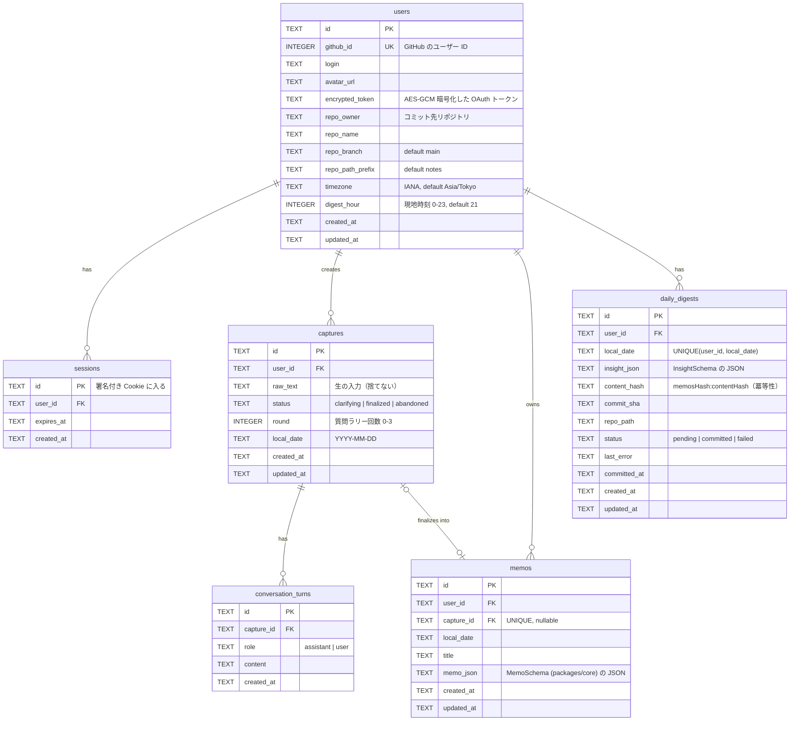

# 03. ER 図

D1（SQLite）。DDL は `apps/web/migrations/0001_init.sql`。ID はすべて UUID（TEXT）。時刻は ISO 8601 UTC 文字列、日付はユーザー現地の `YYYY-MM-DD`。



## `memo_json` の構造（`packages/core/src/memo.ts`）

```jsonc
{
  "title": "先輩レビュー",
  "summary": "資料の構成について指摘を受けた。",
  "facts": ["田中さんが 9/17 に構成順を変えるよう言った"],   // 誰が・何を・いつ
  "keep": ["指摘をその場でメモできた"],                       // 良かったこと
  "try": ["先に目次を見せる"],                                // 次に試すこと
  "next_actions": [{ "text": "目次案を 3 案書く", "minutes": 15, "due": "2026-09-19" }], // 15 分以内
  "people": ["田中さん"],
  "tags": ["資料"],
  "horenso": { "kind": "報告", "to": "田中さん", "draft": "構成を修正しました。..." }
}
```

JSON カラムにした理由: メモ構造はプロンプト改善で頻繁に変わる。列に正規化すると毎回マイグレーションが必要になる。検索は `local_date` と `title` の列で足りる。

## 設計上の決め事

- **`captures` と `memos` を分ける**: 「投げた」時点で保存し、対話の途中でブラウザを閉じても入力を失わない（ペルソナの「情報をロストする」への対策）。
- **`daily_digests.content_hash`**: Cron が毎時走っても、内容が変わらなければ GitHub に触らない。メモ追加後は同じファイルを更新コミットする。
- **トークンは暗号化**: D1 が漏れても GitHub トークンは `TOKEN_ENCRYPTION_KEY`（Worker Secret）なしでは復号できない。
