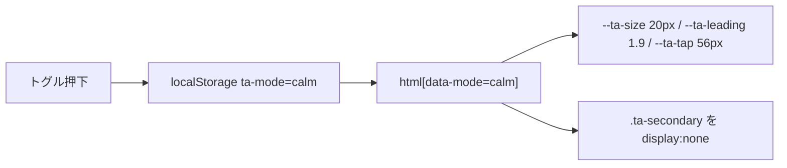
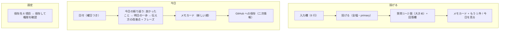

# 05. UI 設計 — 疲れていても読める画面

対象ユーザーは、仕事終わりの疲れた状態でこのアプリを開く。**認知負荷を下げること**が最優先で、見た目の派手さは不要。

## 原則

| # | 原則 | 実装 |
|---|---|---|
| 1 | 文字は大きく、行間は広く | 基準 17px / 行間 1.75。おつかれモードで 20px / 1.9（`--ta-size`, `--ta-leading`） |
| 2 | コントラストは 7:1 以上、純白×純黒は避ける | ライト: `#1f2937` on `#ffffff`、ダーク: `#e5e7eb` on `#1e293b`。OS のダークモードに追従 |
| 3 | 1 画面 1 アクション | 「投げる」画面は入力欄と送信ボタンだけ。注意書きは二次情報 |
| 4 | 読む順番を固定する | メモカード: 要約 → 最初の一歩 → 報連相の下書き → 伝え方 → 良かったこと → くわしく（折りたたみ） |
| 5 | 色の意味を固定する | accent = 操作、good = 良かったこと、warn = 注意、danger = 取り消し。装飾に色を使わない |
| 6 | 押しやすい | タップ領域 48px 以上（おつかれモード 56px）。主要ナビは 3 分割の大ボタン |
| 7 | 動かさない | アニメーションなし。`prefers-reduced-motion` で完全停止 |
| 8 | 二次情報は隠せる | `.ta-secondary` を付けた要素はおつかれモードで非表示（事実・タグ・関係者・入力の再掲・GitHub 状態） |
| 9 | 送る行為を最短にする | 下書き・フレーズは「コピー」ボタン 1 回 |

## おつかれモード

ヘッダーのトグルで切替。`<html data-mode="calm">` を立て、CSS 変数で文字サイズ・行間・タップ領域を変え、`.ta-secondary` を隠す。状態は `localStorage`（`ta-mode`）に保存する。ロジックは `App.tsx`、スタイルは `styles.css` に閉じている。

## 画面構成と情報の優先度

## メモカードの情報設計

| 位置 | 内容 | 疲れているときの役割 |
|---|---|---|
| 1 | タイトル + 要約 | 何の話か 1 秒で分かる |
| 2 | 最初の一歩（1 つ目だけ大きく。残りは二次情報） | 今やることが 1 つに絞られる |
| 3 | 報連相の下書き + コピー | 考えずに送れる |
| 4 | 伝え方: 言い換え（大）/ あなたの言い方（二次）/ 語彙 / コツ 1 つ | 次に同じ場面で使える表現が残る |
| 5 | 良かったこと（緑の帯） | 自己否定の前に良い点を目に入れる |
| 6 | くわしく（折りたたみ・二次情報） | 事実・Try・関係者・タグ・削除 |

## 語彙力・伝え方の観点（データ）

`MemoSchema.communication`（`packages/core/src/memo.ts`）:

| フィールド | 意味 | 上限 |
|---|---|---|
| `said` | 実際に言った／書いた表現（入力から分かる場合） | 300 字 |
| `better` | 相手に伝わる言い換え（結論 → 理由 → 依頼） | 400 字 |
| `vocabulary[]` | `word` と `usage`（意味ではなく「使う場面」） | 3 個 |
| `delivery_tip` | 伝え方のコツ | 1 つ・200 字 |

`InsightSchema.communication`（日次）: `focus`（最も繰り返された癖 1 つ）と `phrase`（明日そのまま使う定型文 1 つ）。

## 検証方法

- 画面幅 360px（スマホ）で横スクロールが出ないこと。
- ブラウザの拡大 150% でレイアウトが崩れないこと（rem ベースのため基本崩れない）。
- ダークモードとおつかれモードの 4 通りで、主要テキストのコントラスト比が 7:1 以上であること。
