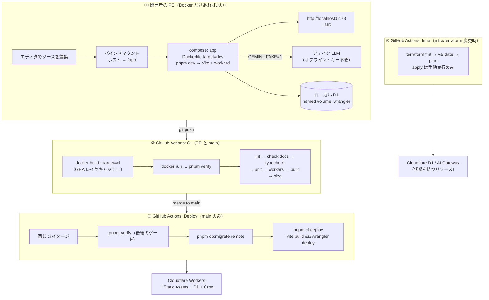
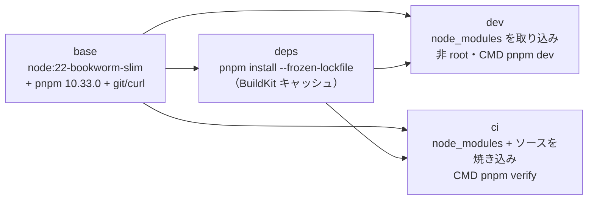
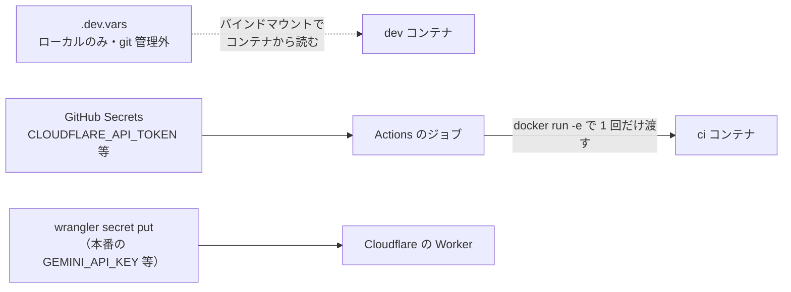

# 06. CI/CD パイプライン

**同じ Docker イメージを、ローカル開発・CI・デプロイの 3 箇所で使い回す**のがこの設計の芯。
「自分の PC では通ったのに CI で落ちる」「CI は通ったのに本番で動かない」を構造的に無くす。

## 全体像

## イメージのステージ構成

`Dockerfile` は 4 ステージ。依存解決を独立させることで、ソースを変えただけでは `pnpm install` が再実行されない。

| ステージ | 使う場所 | ソースの持ち方 |
|---|---|---|
| `base` | 共通 | なし |
| `deps` | 中間層 | `package.json` と `pnpm-lock.yaml` だけ |
| `dev` | `compose.yaml`（app / verify / cli） | バインドマウント（保存即反映） |
| `ci` | GitHub Actions | イメージに焼き込み（再現性優先） |

ベースを Debian（glibc）にしているのは、Cloudflare のローカルランタイム **workerd が musl では動かない**ため。alpine に変えると `pnpm test:workers` が起動しない。

## ワークフロー一覧

| ファイル | 契機 | すること | 必要な Secrets |
|---|---|---|---|
| `.github/workflows/ci.yml` | PR / main への push | `ci` イメージをビルドし、その中で `pnpm verify` | なし |
| `.github/workflows/deploy.yml` | main への push / 手動 | verify → D1 マイグレーション → `wrangler deploy` | `CLOUDFLARE_API_TOKEN`, `CLOUDFLARE_ACCOUNT_ID` |
| `.github/workflows/infra.yml` | `infra/terraform/**` の PR / 手動 | fmt → validate →（Secrets があれば）plan。apply は手動のみ | 上記 + `R2_ACCESS_KEY_ID`, `R2_SECRET_ACCESS_KEY` |

## 秘密情報の扱い

守っている 3 つの約束:

1. **イメージに秘密を焼き込まない**。`.dev.vars` と `infra/terraform/*.tfvars` は `.dockerignore` で除外している。
2. **コンテナの環境変数に置かない**（ローカル）。wrangler が `.dev.vars` を直接読むので、`docker inspect` に値が出ない。
3. **本番の値は Cloudflare 側にだけ置く**。`wrangler secret put` で登録し、リポジトリにも Actions にも残さない。

## 失敗したときの見方

| 症状 | 最初に見る場所 |
|---|---|
| CI の `pnpm verify` が落ちた | ローカルで `pnpm docker:verify`。同じイメージなので同じ結果になるはず |
| ローカルでは通るのに CI で落ちる | `.dockerignore` で除外したファイルに依存していないか（`.git` や `dist` など） |
| Deploy が `database_id` で失敗 | `pnpm infra:sync` の結果が main に入っているか（`docs/ops/cloudflare-setup.md` 手順 4） |
| Deploy が `Missing bindings` で失敗 | `wrangler secret put` の登録漏れ（同 手順 5） |
| イメージの pull で失敗 | Docker Hub の匿名 pull レート制限。`docker/login-action` を足す |
