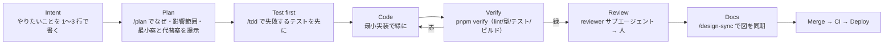

# AI-DLC での開発フロー（TDD / Harness / Loop / Claude Code）

このリポジトリは「AI エージェント（Claude Code 等）が実装の主役で、人はレビューと判断に集中する」前提で組んである。
鍵は 3 つ: **短い検証ループ**、**エージェントが逸脱しない足場**、**トークンを浪費しない情報設計**。

## 1. サイクル（AI-DLC）

各段階の担当:

| 段階 | 人がやる | AI がやる |
|---|---|---|
| Intent | 書く。「誰の・何の困りごとを・どう減らすか」 | 曖昧なら質問する |
| Plan | 案を選ぶ（承認 / 却下 / 別案） | `/plan` の型で なぜ・影響範囲・最小案と代替案 2 つ以上・テスト方針・確認方法を出す |
| Test / Code | 見ない（結果だけ見る） | Red → Green → Refactor。実装中は KISS・PIE・SLAP・OCP（`docs/notes/design-principles.md`） |
| Verify | 見ない | `pnpm verify` を通す |
| Review | 差分を読む（10 分以内で読める粒度に PR を切る） | reviewer サブエージェントで一次レビュー |
| Docs | 図の意味を確認 | Mermaid を更新 |

## 2. TDD の実際

- **内側ループ（秒）**: `pnpm test:unit` … `test/core` と `test/unit`。fetch モック、D1 なし。
- **外側ループ（数秒）**: `pnpm test:workers` … `test/workers`。workerd + D1 実物。
- **ゲート（分）**: `pnpm verify` … CI と同じ。PR 前に必ず。

テストの置き場所は「依存の少ない層」を優先する。ロジックが Cloudflare に依存していないなら `src/core` に移してから書く。

`/tdd <一言>` スキルがこの手順を強制する。

## 3. Harness Engineering（エージェントの足場）

「AI が速く・安全に動けるように整えた環境」を harness と呼ぶ。このリポジトリでの実装:

| 部品 | 場所 | 役割 |
|---|---|---|
| 1 コマンド検証 | `pnpm verify` | AI が「終わった」と言う前の唯一の合格基準 |
| 権限の allow/deny | `.claude/settings.json` | テスト・lint・git は無確認で実行、deploy・secret・.dev.vars 読み取りは禁止 |
| PreToolUse フック | `.claude/hooks/guard-migrations.sh` | 適用済みマイグレーションの改変と秘密ファイルへの書き込みをブロック |
| PostToolUse フック | `.claude/hooks/format-changed.sh` | 編集したファイルだけ Biome 整形（全体 lint より速い） |
| パス別ルール | `.claude/rules/*.md` | 触るファイルに応じて必要なルールだけ読み込まれる |
| スキル | `.claude/skills/` | `/plan` `/tdd` `/learn` `/design-sync` `/pr-ready` の定型手順 |
| サブエージェント | `.claude/agents/` | `reviewer`（読み取り専用）と `test-writer`（テストのみ書く） |
| 型で守る | Hono RPC + zod | API のズレ・LLM 出力の崩れをビルド/実行時に検出 |
| CI | `.github/workflows/ci.yml` | 速い順に並列（lint/型 → 単体 → 結合 → ビルド + バンドルサイズ検査） |
| 学びの台帳 | `.claude/MEMORY.md` + `/learn` | ハマりを hooks / rules / settings / CLAUDE.md / notes へ昇格。未反映なら Stop フックが差し戻す |
| ドキュメントのズレ検知 | `scripts/check-claude-md.mjs`（`pnpm check:docs`） | CLAUDE.md / rules のパスとコマンドが実在するかを CI と Stop フックで検査 |

## 4. Loop Engineering（ループを短く保つ）

1. **速いものを先に落とす**: CI は `static` → `unit` → `integration` → `build` の順で並列。lint で落ちるのに 10 分待たない。
2. **ローカルと CI を同じコマンドにする**: `pnpm verify`。「CI でだけ落ちる」を作らない。
3. **決定的にする**: 時刻・ID・fetch は `Deps` で注入。LLM はフェイク。スナップショットはインライン。
4. **失敗の理由を 1 行で出す**: `ProtocolError` / `GeminiError` / `GitHubError` はメッセージに原因を持つ。AI が読んで直せる。
5. **副作用のある操作は冪等に**: Cron・コミットは何度実行しても同じ結果（`content_hash`）。再実行を怖がらない。

## 5. Claude Code のベストプラクティスの適用

Boris Cherny（Claude Code 開発者）が公開しているワークフローの tips を、このリポジトリでどう実装したかの対応表:

| tip | ここでの実装 |
|---|---|
| CLAUDE.md をチームの共有メモリにし、短く保つ | `CLAUDE.md` は 40 行。詳細は `.claude/rules/` と `docs/` にリンク |
| 大きな変更は plan mode から | `docs/dev/ai-dlc.md` 1 章。PR テンプレにも「なぜ」を要求 |
| AI に「検証手段」を与える | `pnpm verify`、結合テスト、`/api/health` |
| サブエージェントで検証・探索を分離 | `reviewer` / `test-writer` |
| worktree で並行セッション | `scripts/worktree.sh`（`docs/notes/parallel-development.md`） |
| よく使う手順はスラッシュコマンド化 | `.claude/skills/tdd` ほか |
| フックで整形・ガード | `.claude/hooks/` |
| 権限を allowlist にして確認疲れを減らす | `.claude/settings.json` |
| コンテキストを小さく（`/clear` を頻繁に、1 セッション 1 タスク） | 1 PR = 1 関心事のルール |
| 無人実行は sandbox で（CI や worktree） | CI は読み取り権限のみ。deploy は main マージ時のみ |

## 6. トークン節約とキャッシュヒット率

Claude Code はシステムプロンプト + CLAUDE.md + ルールを毎ターン送る。**先頭が安定しているほどプロンプトキャッシュが効く**。

- **CLAUDE.md に可変情報を書かない**（日付・ブランチ名・TODO・進捗）。それらは `docs/` か Issue へ。
- **Progressive disclosure**: `.claude/rules/*.md` は `paths:` でスコープし、該当ファイルを触るときだけ読み込まれる。全ルールを CLAUDE.md に貼らない。
- **MCP サーバーを増やさない**: ツール定義はプロンプトに常駐する。必要なものだけ `.mcp.json` に。
- **大きなファイルを丸ごと読ませない**: `worker-configuration.d.ts`（生成物）や `pnpm-lock.yaml` は Biome の対象外にし、AI にも読ませない（設定の `deny` 参照）。
- **探索はサブエージェントに**: 検索・読み込みの大量の出力を親コンテキストに入れない。
- **同じ質問を繰り返さない**: 決めたことは ADR に書く。AI も人も ADR を読めば済む。
- **LLM 側（Gemini）も同じ**: プロンプトは安定部分（system）を先頭、可変（入力・履歴）を末尾に。`src/core/prompts.ts` 参照。

## 7. 人が守ること（メンターからの注意）

- **PR は 10 分で読める大きさ**。読めない PR は AI にも人にも危険。
- **AI の「終わりました」は `pnpm verify` の緑で確認する**。言葉を信じない、出力を信じる。
- **設計を変えたら ADR を 1 枚**。3 行でいい。未来の自分が最初の読者。
