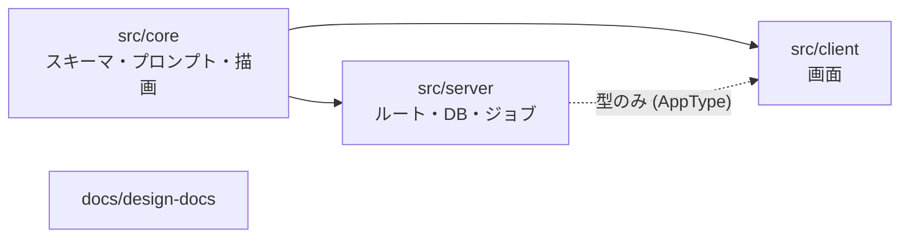

# 並行開発の進め方

複数人、または複数の Claude Code セッションが同時に進められるように、**境界**・**作業単位**・**統合**を決めてある。

## 1. 境界（同時に触っても衝突しにくい単位）



| 領域 | 契約（境界を越えるもの） | 同時作業の可否 |
|---|---|---|
| `src/core` | `src/core/index.ts` から export される関数と zod スキーマ。`tsconfig.core.json` で Workers/DOM 型が見えない | スキーマ変更は先に core だけの PR にする |
| `server` | `AppType`（Hono RPC）と D1 スキーマ | ルート追加同士は衝突しない。`app.ts` の `.route()` 1 行だけ競合しうる |
| `client` | `api.ts` 経由の型 | 画面ごとに独立 |
| `migrations` | 連番ファイル | **番号が衝突する**。PR 作成時に付番し直す |

`.github/CODEOWNERS` に担当を書けばレビュー依頼が自動化される。

## 2. 作業単位

- 1 ブランチ = 1 関心事 = 1 PR（10 分で読める）。
- 順番: **core → server → client** の順に PR を積む。逆順は型エラーで詰まる。
- スキーマ（`MemoSchema`）を変えるときは、core の PR にレンダリングのスナップショット更新を含める。

## 3. worktree で同時にセッションを開く

```bash
scripts/worktree.sh add feat-memo-mood      # ../TaskAgent.wt/feat-memo-mood
cd ../TaskAgent.wt/feat-memo-mood && claude # 別セッション
scripts/worktree.sh ls
scripts/worktree.sh rm feat-memo-mood
```

worktree ごとに `node_modules` と `.wrangler`（ローカル D1）が分かれるので、テストが干渉しない。

## 4. 統合

- CI（`ci.yml`）は PR ごとに並列で走る。`main` は常に緑。
- マイグレーションの競合は「番号を振り直して rebase」。既存ファイルの編集はフックが止める。
- デプロイは `main` へのマージのみ（`deploy.yml`）。ブランチからは deploy しない（`.claude/settings.json` で deny）。

## 5. 衝突しやすい場所と対策

| 場所 | 対策 |
|---|---|
| `src/server/app.ts` の `.route()` | 新ルートは末尾に追加。1 行の競合は rebase で解決 |
| `src/core/index.ts` の re-export | ファイル単位で `export *`。新ファイル追加時のみ触る |
| `docs/design-docs/03-er-diagram.md` | テーブル追加は末尾に。`/design-sync` で自動更新 |
| `pnpm-lock.yaml` | 依存追加は専用 PR に分ける |
