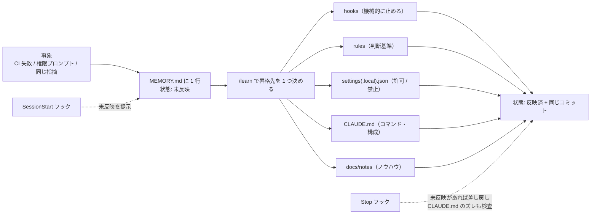

# 学びをガードレールに昇格する運用（Claude Code のメモリ）

- いつ読むか: 同じ失敗を 2 回したとき。権限プロンプトが毎回出るとき。CLAUDE.md が実体とズレているとき。
- 結論: 学びは `.claude/MEMORY.md` に 1 行書き、**同じコミットで** hooks / rules / settings / CLAUDE.md / docs のどれかに昇格する。放置すると Stop フックが差し戻す。

## 仕組み

| 部品 | 役割 |
|---|---|
| `.claude/MEMORY.md` | チーム共有の台帳。git 管理 |
| `.claude/hooks/session-start.sh` | 起動時に未反映の学びと、`settings.local.json` にだけある allow を表示 |
| `.claude/hooks/stop-check.sh` | 終了時に未反映の学び・CLAUDE.md のズレがあれば exit 2 で差し戻す（`stop_hook_active` で二重差し戻しを防止） |
| `scripts/check-claude-md.mjs` | CLAUDE.md と rules に書かれたパス・`pnpm` コマンドが実在するか検査。`pnpm verify` と CI でも実行 |
| `.claude/skills/learn/SKILL.md` | 昇格の手順 |
| `.claude/settings.local.json` | 個人用の許可。git 管理外。共有できるものは `settings.json` へ |
| `CLAUDE.local.md` | 個人用のメモ。git 管理外。チームの知識にすべきものは MEMORY.md へ |

## CLAUDE.md を自律的に更新する条件

次のどれかに当たる変更は、同じ PR で CLAUDE.md を更新する（更新しないと `check:docs` か Stop フックが止める）:
- `package.json` の scripts の追加・改名
- `src/` `test/` `docs/` 直下のフォルダの追加・改名
- 開発ルール（TDD・Deps 注入・zod 検証など）の追加・変更

CLAUDE.md は 40〜60 行を維持する。増えたら詳細を `.claude/rules/` か `docs/` に逃がす。

## 落とし穴

- Stop フックで exit 2 を返すと Claude は終了できず修正に戻る。無限ループを防ぐため `stop_hook_active` を必ず見る。
- `tsconfig` の `extends` が壊れると `tsc` が `noEmit` を失って `.js` を吐く。構成を動かした直後は `git status` で見慣れないファイルが無いか確認する。
- フックの入力は JSON。`sed` で抜くと壊れやすいので `node -e` で parse する。

## 関連
- 元になった学び: 2026-09-18（`.claude/MEMORY.md`）
