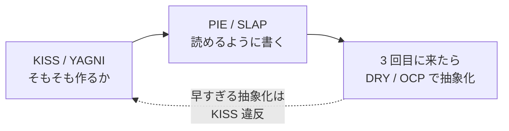

# 実装するときの設計原則（KISS・PIE・SLAP・OCP）

- いつ読むか: 実装に入る前と、`/tdd` の Refactor 段。レビューで「読みにくい」と言われたとき。
- 結論: **単純に保ち（KISS）、意図を語らせ（PIE）、1 つの関数の抽象度を揃え（SLAP）、足すときに既存を触らずに済む形にする（OCP）**。

抽象論にしないため、すべてこのリポジトリの実コードで説明する。

## KISS — Keep It Simple, Stupid

必要以上の仕組みを入れない。**仕組みを 1 つ増やすたびに、読む人と将来の自分が払う税金が増える**。

| このリポジトリでの判断 | どうしたか |
|---|---|
| CI とローカルの環境一致 | GHCR にイメージを push して並列ジョブで使う案を捨て、単一ジョブで `docker run` した（[ADR-0008](../design-docs/adr/0008-run-ci-inside-dev-image.md)） |
| core の純粋性を守る | 別パッケージに分ける代わりに、`tsconfig.core.json` の `types: []` で型レベルに縛った（[ADR-0005](../design-docs/adr/0005-flatten-to-single-package.md)） |
| ドキュメント検査の例外 | 「ここは検査しない」という仕組みを足さず、文面の方を直した |

判断の問い: **その仕組みが無いと本当に困るか？** 困らないなら入れない。

## PIE — Program Intently and Expressively

「意図を持って、表現豊かに書く」。コードは**何をしているか**ではなく**何をしたいか**を語るべきで、
コメントで補うより先に、名前と構造で伝える。

```ts
// src/core/memo.ts — 数字の意味が名前で分かる
export const MAX_ACTION_MINUTES = 15;

// src/server/lib/gemini-factory.ts — 「環境に応じて本物かフェイクか」が関数名で分かる
export function createGeminiFor(env: Bindings, fetchImpl: typeof fetch): GeminiClient
```

逆に、**なぜそうしたか**は名前で表せないのでコメントに書く。

```ts
// vite.config.ts
// コンテナ内で 0.0.0.0 を待ち受けないと、ホストからポート転送で届かない
host: true,
```

判断の問い: **この名前だけ読んで、中を開かずに使えるか？**

## SLAP — Single Level of Abstraction Principle

1 つの関数の中では、**抽象度を揃える**。「大きな話」と「細かい話」を混ぜない。

`src/server/jobs/digest.ts` の `runDigestForUser` は、次の粒度だけを並べている。

1. メモを読む
2. インサイトを作る（失敗してもコミットは止めない）
3. Markdown を描画する
4. 変わっていなければ何もしない
5. GitHub にコミットして結果を記録する

base64 変換や SHA-256 の計算といった細部は `src/server/lib/crypto.ts` と `src/server/lib/github.ts` に降りている。
もし同じ関数の中で「メモを読む」と「バイト列を base64 にする」が並んでいたら、SLAP 違反のサイン。

判断の問い: **関数の中身を声に出して読んで、粒度が揃っているか？**

## OCP — Open-Closed Principle

**拡張に対して開き、修正に対して閉じる**。機能を足すときに、既存のコードを書き換えずに済む形にする。

このリポジトリで効いている例。

| 拡張したいこと | 触る場所 | 触らずに済む場所 |
|---|---|---|
| LLM を差し替える（本物 / フェイク / 別ベンダー） | `createGeminiFor` と新しいクライアント 1 つ | ルート 3 つ・Cron ジョブ（`GeminiClient` 型だけ見ている） |
| テストで外部 API の応答を変える | `fakeExternal()` のスクリプト | サーバー実装（`Deps` で注入しているため） |
| DB にテーブルを足す | `migrations/` に新しい番号のファイル | 既存のマイグレーション（編集禁止） |

逆に閉じられていない箇所は、**同じ変更のたびに複数ファイルを触る**ことで気づく。
実際、メモのスキーマに 1 フィールド足したときにテスト 4 ファイルを直す羽目になり、`test/fixtures/memo.ts` を作った。

判断の問い: **次に同じ種類のものを足すとき、何ファイル触るか？**

## YAGNI・DRY との関係

順番がある。**先に KISS と YAGNI で「作らない」を決め、作ると決めたものに PIE・SLAP を当て、
同じ変更が 3 回目に来たら DRY と OCP で抽象化する**。



最初から OCP を狙って拡張点を作り込むのは、たいてい KISS 違反になる。**2 回目までは我慢する**。

## 関連
- 手順: `.claude/skills/plan/SKILL.md`（実装前の計画）、`.claude/skills/tdd/SKILL.md`（Red → Green → Refactor）
- レビュー観点: `.claude/agents/reviewer.md`
