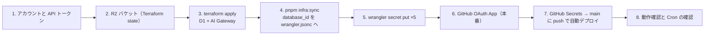

# Cloudflare 環境構築手順書

TaskAgent を Cloudflare 無料枠で本番稼働させるまでの手順。**上から順に、チェックを付けながら進める**。所要時間はおよそ 60 分。
「状態を持つもの（D1・AI Gateway・state 置き場）」は Terraform、「デプロイするもの（Worker）」は wrangler、という分担（[ADR-0006](../design-docs/adr/0006-terraform-for-stateful-resources.md)）。



## 0. 前提

- [ ] Cloudflare アカウント（無料プラン）
- [ ] GitHub アカウントとこのリポジトリへの push 権限
- [ ] ローカル: Node.js 22+、pnpm 10、Terraform 1.9+（`brew install terraform` など）
- [ ] Google AI Studio の Gemini API キー

## 1. アカウントと API トークン

- [ ] アカウント ID を控える: ダッシュボード → Workers & Pages → 右側「Account ID」（または `pnpm exec wrangler whoami`）
- [ ] API トークンを作る: My Profile → API Tokens → Create Token → Custom
  | 権限 | 用途 |
  |---|---|
  | Account / D1 / Edit | Terraform で D1 作成、CI でマイグレーション |
  | Account / Workers Scripts / Edit | wrangler deploy |
  | Account / Workers AI Gateway / Edit（AI Gateway） | Terraform で Gateway 作成 |
  | Account / Workers R2 Storage / Edit | state バケット作成（手動作成なら不要） |
- [ ] `export CLOUDFLARE_API_TOKEN=...`

## 2. Terraform state の置き場（R2）

- [ ] R2 → Create bucket → 名前 `taskagent-tfstate`（無料枠 10GB）
- [ ] R2 → Manage R2 API Tokens → Create → Object Read & Write、対象バケットを `taskagent-tfstate` に限定
- [ ] 出力された Access Key ID / Secret Access Key を控える
- [ ] `export AWS_ACCESS_KEY_ID=... AWS_SECRET_ACCESS_KEY=...`

## 3. Terraform で D1 と AI Gateway を作る

```bash
cd infra/terraform
cp backend.hcl.example backend.hcl        # <ACCOUNT_ID> を置換
cp terraform.tfvars.example terraform.tfvars   # cloudflare_account_id を記入
terraform init -backend-config=backend.hcl
terraform plan                             # 作成されるのが D1 1 つと AI Gateway 1 つであることを確認
terraform apply
terraform output                           # d1_database_id と ai_gateway_base_url が出る
```

- [ ] `terraform plan` の差分が 2 リソースの追加だけであることを確認した
- [ ] `terraform apply` が成功した

## 4. wrangler.jsonc へ反映

```bash
cd ../..
pnpm infra:sync        # database_id を書き換える
git diff wrangler.jsonc
```

- [ ] `database_id` がプレースホルダ（0000...）から実 ID に変わった
- [ ] 変更をコミットして `main` に入れる（PR 経由）

## 5. アプリの Secrets

```bash
pnpm exec wrangler login
for k in GITHUB_CLIENT_ID GITHUB_CLIENT_SECRET GEMINI_API_KEY TOKEN_ENCRYPTION_KEY SESSION_SECRET; do
  pnpm exec wrangler secret put $k
done
# AI Gateway を使う場合（terraform output の ai_gateway_base_url）
pnpm exec wrangler secret put GEMINI_BASE_URL
```

| 名前 | 値 |
|---|---|
| `GITHUB_CLIENT_ID` / `GITHUB_CLIENT_SECRET` | 手順 6 で作る本番用 OAuth App |
| `GEMINI_API_KEY` | Google AI Studio |
| `TOKEN_ENCRYPTION_KEY` | `openssl rand -base64 32` |
| `SESSION_SECRET` | `openssl rand -hex 32` |
| `GEMINI_BASE_URL`（任意） | `terraform output -raw ai_gateway_base_url` |

- [ ] 5（+1）件を登録した。**値はどこにも書き残さない**

## 6. GitHub OAuth App（本番用）

- [ ] GitHub → Settings → Developer settings → OAuth Apps → New
  - Homepage: `https://taskagent.<your-subdomain>.workers.dev`
  - Callback: `https://taskagent.<your-subdomain>.workers.dev/api/auth/callback`
- [ ] Client ID / Secret を手順 5 で登録した（未登録なら今登録）

## 7. GitHub Actions からの自動デプロイ

- [ ] リポジトリ → Settings → Secrets and variables → Actions に登録
  | Secret | 値 |
  |---|---|
  | `CLOUDFLARE_API_TOKEN` | 手順 1 のトークン |
  | `CLOUDFLARE_ACCOUNT_ID` | 手順 1 のアカウント ID |
  | `R2_ACCESS_KEY_ID` / `R2_SECRET_ACCESS_KEY` | 手順 2（Infra ワークフロー用） |
- [ ] Settings → Environments → `production` を作成（承認者を付けると apply / deploy に人の確認が入る）
- [ ] `main` に push → Actions の「Deploy」が緑になる

## 8. 動作確認

- [ ] `https://taskagent.<your-subdomain>.workers.dev/api/health` が `{"ok":true,"env":"production"}`
- [ ] GitHub でログインできる
- [ ] 設定画面で保存先リポジトリを保存でき、「権限も確認済み」と出る
- [ ] メモを 1 件投げ、「今すぐコミット」で GitHub にファイルができる
- [ ] Cron: ダッシュボード → Workers → taskagent → Settings → Triggers に `0 * * * *` がある。翌日 `digest_hour` 後に自動コミットされる
- [ ] AI Gateway を使う場合: AI → AI Gateway → taskagent にログが流れる

## 困ったとき

| 症状 | 見る場所 |
|---|---|
| Deploy が `database_id` で失敗 | 手順 4 が `main` に入っているか |
| `Missing bindings: ...` | 手順 5 の Secret 名の綴り |
| OAuth で `redirect_uri` エラー | 手順 6 の Callback URL と実 URL の一致 |
| Gemini 429 | AI Gateway のレート制限（`ai_gateway_rate_limit_per_minute`）と Gemini 無料枠 |
| terraform init で 403 | R2 API トークンの対象バケット |

## やり直し・撤去

- D1 は `prevent_destroy = true`。消すときは `main.tf` から外してから `terraform destroy`
- Worker は `pnpm exec wrangler delete`
